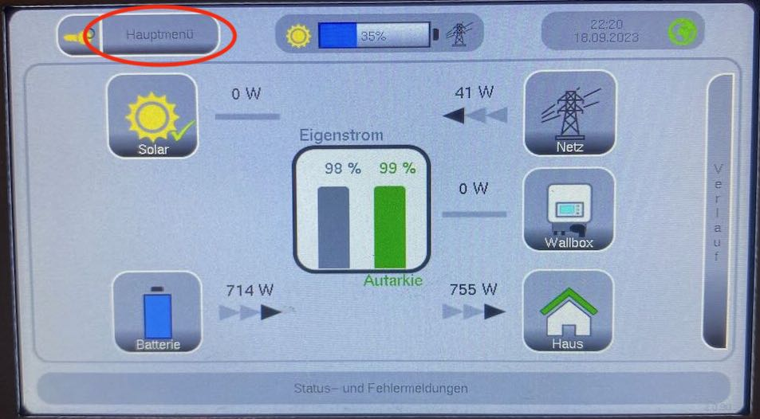
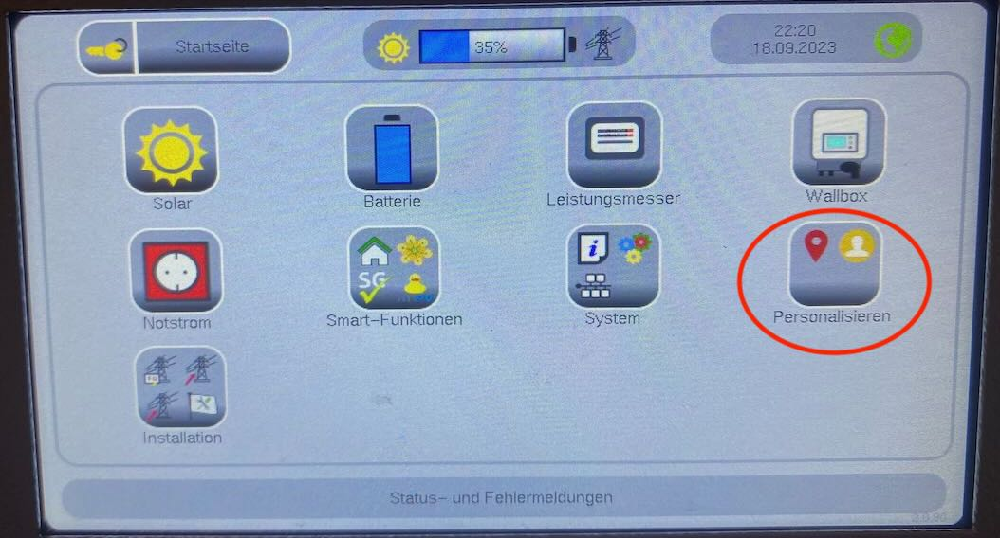
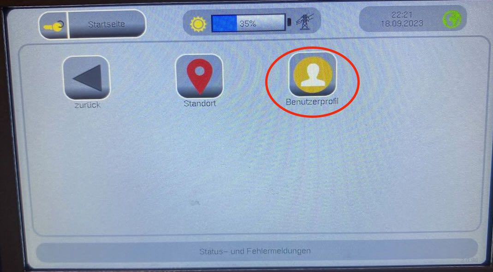
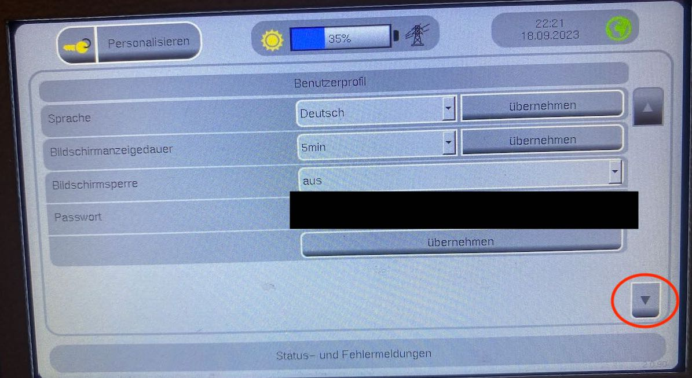
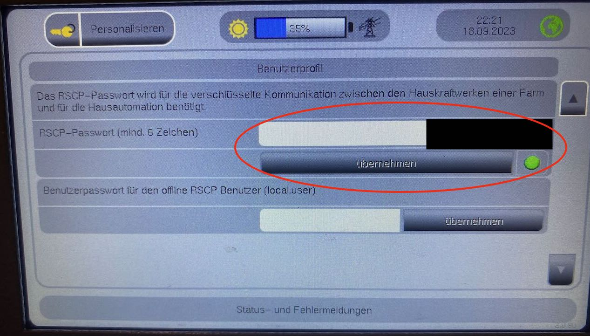

# Setting up the RSCP interface at the home power plant

By default, the RSCP interface is disabled on the home power plant. Therefore you have to go to the home power plant once and activate the RSCP interface. Details can be found in the manual of your home power plant.

As an example I show the setup on my S10X (On other models it should be similar). The pictures are in german (sorry for that), but it should be easy to adapt.

## Setup on the S10X home power plant

<figure markdown>
  { width=75% }
  <figcaption>Switch from the main page to the main menu</figcaption>
</figure>


<figure markdown>
  { width=75% }
  <figcaption>Select "Personalize" in the main menu</figcaption>
</figure>


<figure markdown>
  { width=75% }
  <figcaption>Select "Profile" here</figcaption>
</figure>


<figure markdown>
  { width=75% }
  <figcaption>Go to the next page</figcaption>
</figure>


<figure markdown>
  { width=75% }
  <figcaption>Set password and confirm -> The small lamp must now light up green</figcaption>
</figure>


## Using the library

???+ danger "Warning of damage to your home power plant"

    This library is provided absolutely without any warranty. You can use it for write access to E3DC home power plants. The library does not validate in any way whether the requests make sense. The usage is completely in the responsibility of the user!

The library is divided into three sections

| artifact-id            | Description                                                                                                                                                 | 
|------------------------|-------------------------------------------------------------------------------------------------------------------------------------------------------------| 
|                        |                                                                                                                                                             | 
| jnk-easy-rscp-api      | Mainly contains interfaces and descriptions of the library. The other modules implement the interfaces.                                                     | 
| jnk-easy-rscp-lowlevel | RSCP interface at the bottom. Here you can compile an RSCP request down to the byte, send it and interpret the response.                                    | 
| jnk-easy-rscp-service  | Higher level that hides RSCP subtleties behind services. Most users should use this module. The scope will be extended in future version. | 

=== "Maven"
    ```xml
    <dependency>
        <groupId>de.jnkconsulting.e3dc.easyrscp</groupId>
        <artifactId>jnk-easy-rscp-service</artifactId>
        <version>2.0.0</version>
    </dependency>
    ```
=== "Gradle (groovy)"
    ```groovy
    implementation 'de.jnkconsulting.e3dc.easyrscp:jnk-easy-rscp-service:2.0.0'
    ```
=== "Gradle (kotlin)"
    ```kotlin
    implementation("de.jnkconsulting.e3dc.easyrscp:jnk-easy-rscp-service:2.0.0")
    ```


