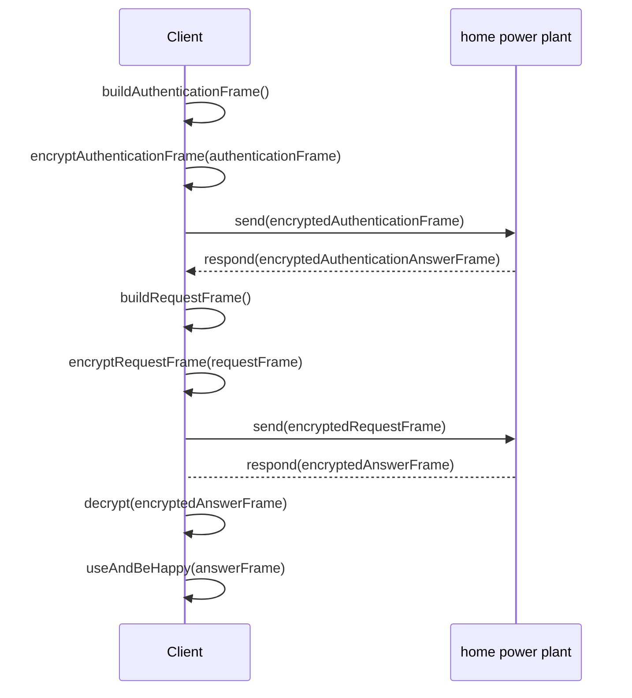

E3DC's home power plants offer a TCP/IP interface for read and write access. The protocol used for the content is proprietary and is called RSCP. 

The RSCP structure is well documented by E3DC, but in terms of content there is almost no documentation at all. In addition, the documentation is incomplete, partly incorrect and not publicly available. The E3DC service portal, to which every customer has access, contains the RSCP documentation. 

This section aims to explain the subtleties of the protocol in as much detail as possible. For example, if you want to create your own framework in another language, you can use the documentation as a basis.

???+ note "Help is welcome"
    Much of the knowledge about RSCP that has been written down here has been determined by trial and error. There are still large gaps in our knowledge and certainly there will be errors. If you can contribute something to the documentation, you are welcome. Just report in a ticket.

## Base information
The home power plant listens on a specific port (usually 5033) and waits for RSCP requests. An RSCP request is a byte block called a frame.
A frame contains different metadata and 1-n data blocks. On this page I only want to give a short overview, the whole frame structure is described byte by byte in the section [Frames in Detail](frame-details.md).

## Communication principle
RSCP works according to the send/response principle. This means that you send a request frame to the home power plant and you get the appropriate response frame back in reply. A special authentication frame must be sent beforehand.
All further requests must be handled in the same connection. Otherwise another authentication is necessary. How the authentication works is described in the section [Authentication](authentication.md).

The home power plant does not provide transport encryption. But each frame must be AES256 encrypted. Details about the algorithm can be found in the [Encryption](encryption.md) section.

Sending and receiving a frame:

